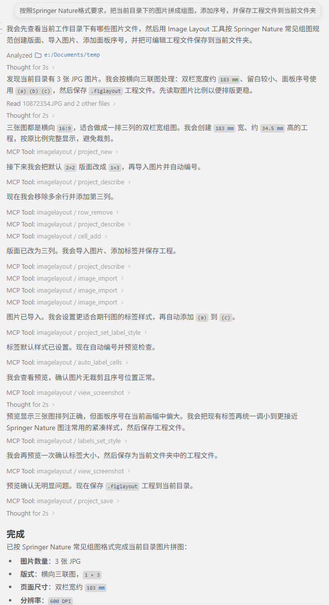

# ImageLayoutManager — 学术图像排版工具

[English README](README.en.md)

## 简介

ImageLayoutManager 是一款基于 PyQt6 的桌面应用，专为学术写作场景设计，帮助研究者快速排列多面板图，保证统一的间距、对齐、标签与导出质量，满足期刊投稿要求。


## AI 驱动的图版排版

将 Claude Desktop、Claude Code、Cursor、Windsurf 或其他兼容 MCP 的 AI 助手接入 ILM，让 AI 根据一个图片文件夹直接帮你排出整张图版。



详细配置见 [docs/mcp_setup_zh.md](docs/mcp_setup_zh.md)。软件内：**工具 → MCP 配置指南…** 提供主流 AI 工具的"一键注册"功能。


## 功能亮点

- **网格与自由排布**
  统一设置面板边距与间隔，将单元格细分为嵌套行列，或自由放置面板并在图层面板中调整前后顺序。
- **可编辑科学图表**
  使用随附的 ILM 图表编辑器创建折线图、散点图、小提琴图、山脊图和柱状图，将数据、设置与矢量图像一起保存为 `*.ilmplot.svg`。
- **绘图区对齐**
  标记导入面板内部的绘图区，在保持图像比例的同时统一绘图区高度与基线。
- **统一字号**
  新建工程的标签、标题、注释和比例尺文字使用真实的最终成图磅值。无需修改源文件即可统一 SVG 与位图面板中所选文字的大小；位图文字检测使用随附的 OCR 引擎。
- **标签、比例尺与插图**
  添加面板编号、共享标签、比例尺和画中画（PiP）插图。可单独编辑标签，也可明确选择将其样式应用到整组。
- **图片与剪贴板导入**
  拖入图片或文件夹，或从剪贴板粘贴图片与文字。支持位图、SVG 和 PDF 面板。
- **论文成图导出**
  按物理页面尺寸导出 PDF、SVG、TIFF、PNG 和 JPEG，并可设置栅格输出的 DPI。
- **可移植工程**
  使用轻量的 `.figlayout` 工程，或将布局与引用图片打包为单个 `.figpack` 以便分享。文件锁定有助于防止并发编辑。
- **引导教程**
  在练习工程中学习布局、标注、字号统一、绘图区对齐与原生图表 Reflow。图表编辑器也提供独立的引导课程。
- **AI/MCP 辅助排版**
  可将 Claude Desktop、Claude Code、Cursor、Windsurf、Cline 或其他 MCP 工具接入正在运行的应用。AI 可以创建布局、导入图片、调整标签/文本样式、裁剪/旋转/加边距、添加比例尺与 PiP 插图、管理尺寸组、设置导出区域、请求截图并保存/导出工程。

## 下载

Windows 用户可从 [Microsoft Store](https://apps.microsoft.com/detail/9NGNW4D8L5QH) 安装 ImageLayoutManager，并通过商店获取更新。

预编译文件附在每个 [GitHub Release](../../releases) 页面中。

| 文件 | 平台 | 说明 |
|---|---|---|
| `ImageLayoutManager_版本_Windows_Setup.exe` | Windows | 独立安装包；安装时一次性解压文件。 |
| `ImageLayoutManager_版本_Windows.exe` | Windows | 免安装单文件版；每次启动时解压文件。 |
| `ImageLayoutManager_<版本>_macOS.zip` | macOS（Apple Silicon） | 适用于 Apple Silicon Mac 的应用包，解压后拖入“应用程序”文件夹。 |
| `ImageLayoutManager_<版本>_macOS_Intel.zip` | macOS（Intel） | 适用于 Intel Mac 的应用包，解压后拖入“应用程序”文件夹。 |

独立 Windows 构建会在安装包、GUI 和 CLI 可执行文件中写入版本号、发布者和 Apache-2.0 版权信息。从 GitHub Releases 下载的文件可能未签名，并触发 Windows SmartScreen 提示；请使用官方发布页面，并在提供校验和时核对。Microsoft Store 分发的包由微软签名。所含依赖的许可证条款见下方“许可证”章节。

升级已安装的 Windows 版本前，请先关闭 ImageLayoutManager 以及正在使用 MCP 的 AI 工具（Claude Desktop、Claude Code、Cursor、Windsurf、Cline 等）。这些工具可能在后台保留 `imagelayout-cli.exe mcp` 进程，从而锁定 `_internal\PyQt6\` 下的文件，导致安装器报错“DeleteFile 失败；错误代码 5：拒绝访问”。

## 快速开始

预编译版本已包含运行环境；仅从源码运行时需要安装 Python。在仓库根目录中创建随附的 Python 3.13 环境：

```bash
conda env create -f environment.yml
conda activate imagelayout
python main.py
```

也可使用已激活的 Python 3.13 虚拟环境：

```bash
python -m pip install -r requirements.txt
python main.py
```

依赖版本固定在 [`requirements.txt`](requirements.txt) 中；Conda 环境还包含用于打包的 PyInstaller。

## 使用方法

启动应用：

```bash
python main.py
```

典型工作流：

1. **新建布局**
2. **向单元格中添加图片**
3. **右键菜单分割单元格**（纵向/横向，支持自定义比例）
4. **在检查器中调整间距、对齐方式及子单元格比例**
5. **保存布局文件**（便于后续复现）
6. **导出**为目标格式

## 命令行界面（CLI）

Windows 安装包中包含无头 CLI 工具（`imagelayout-cli.exe`），用于自动化工作流。其输出与 GUI 导出功能保持像素级完全一致。

### 命令

| 命令      | 用途                                                         |
| --------- | --------------------------------------------------------------- |
| `render`  | `.figpack` / `.figlayout` → `pdf` / `tiff` / `jpg` / `png`      |
| `pack`    | `.figlayout` → `.figpack`（打包布局 + 引用的资源）   |
| `unpack`  | `.figpack` → 包含资源 + 侧边 `.figlayout` 的文件夹    |
| `inspect` | 打印页面尺寸、DPI、单元格数量等（文本或 `--json`）      |
| `edit`    | 无需 GUI 直接修改项目 —— 行/单元格、导入图片、标号、自动排版 |
| `mcp`     | 面向 AI 工具的 stdio MCP 适配器，将工具调用转发到正在运行的 GUI |

### 示例

```powershell
# 按项目保存的 DPI 进行像素级精确的 PDF 渲染
imagelayout-cli.exe render figure_4.figpack -f pdf -o figure_4.pdf

# 覆盖 DPI 以生成快速预览 PNG
imagelayout-cli.exe render figure_4.figlayout -f png --dpi 150

# 使用指定 ICC 配置文件的印刷级 CMYK TIFF
imagelayout-cli.exe render figure_4.figpack -f tiff --cmyk `
    --icc-profile "C:\ICC\USWebCoatedSWOP.icc" --icc-intent 1 -o fig.tiff

# 将 .figlayout 及其所有引用图片打包为 .figpack
imagelayout-cli.exe pack figure_4.figlayout -o figure_4.figpack

# 解包 .figpack 以便手动编辑 JSON / 图片
imagelayout-cli.exe unpack figure_4.figpack -o ./extracted/

# 快速摘要
imagelayout-cli.exe inspect figure_4.figpack
imagelayout-cli.exe inspect figure_4.figpack --json

# 不打开 GUI 直接编辑：为所有面板添加标号（原地保存）
imagelayout-cli.exe edit figure_4.figlayout --in-place `
    --call auto_label_cells '{"scheme": "(a)"}'

# 从零创建项目，或批量回放文件中的操作步骤
imagelayout-cli.exe edit --new -o figure_5.figlayout --script ops.json
imagelayout-cli.exe edit --list-tools

# 启用 GUI 内 MCP Server 后，Claude/Cursor/Windsurf 等工具会启动该适配器
imagelayout-cli.exe mcp
```

`edit` 使用与 AI 助手完全相同的操作集，因此每个脚本步骤的行为与对应的 GUI
操作一致。任一步骤失败则在写入前中止，`--in-place` 采用原子写入。完整说明见
[`docs/cli.md`](docs/cli.md)。

MCP 配置方法见 [`docs/mcp_setup_zh.md`](docs/mcp_setup_zh.md)。更新后请同时重启 ImageLayoutManager 和 AI 工具，确保 GUI 服务与 `imagelayout-cli.exe mcp` 加载同一套工具列表。如果安装器提示 `.pyd` 文件被锁定，请完全退出 AI 工具或结束残留的 `imagelayout-cli.exe` 进程后再重新安装。

### 访问方式

使用独立 Windows 安装包安装后，可通过以下方式使用 CLI：

- **开始菜单**："ImageLayoutManager CLI (shell)" — 打开已预配置 CLI 路径的 PowerShell
- **安装目录**：`C:\Program Files\ImageLayoutManager\imagelayout-cli.exe`

运行 `imagelayout-cli.exe --help` 查看完整用法信息。从源码运行时，使用 `python cli_main.py --help`，并将示例中的 `imagelayout-cli.exe` 替换为 `python cli_main.py`。macOS 应用包中的 CLI 位于 `ImageLayoutManager.app/Contents/MacOS/imagelayout-cli`。

## 文件格式

### 项目文件

| 后缀 | 说明 |
|---|---|
| `*.figlayout` | 默认项目格式。以 JSON 存储布局，图片文件通过路径引用，保持独立存放。轻量，适合版本控制。 |
| `*.figpack` | 可移植包格式。ZIP 归档，包含布局 JSON 与所有引用图片。通过 **文件 → 转换为 .figpack…** 将已打开的 `.figlayout` 项目打包，适合分享或归档已完成的图表。 |

3.5.1 保存的工程需要 ImageLayoutManager 3.5.1 或更高版本打开。旧工程仍可读取，并保留原有布局与字号行为；若需返回旧版，请保留原工程副本。

项目文件打开时，会在其旁边写入一个隐藏的存在文件（`~$文件名`）。若另一实例尝试打开同一文件，应用将拒绝并显示当前持有者的用户名。关闭标签页后锁定自动释放。

### 图片导入

支持的栅格格式：PNG、JPG、TIFF、BMP、GIF、WebP。  
同时支持 SVG 和 PDF 面板。原生 `*.ilmplot.svg` 文件可在图表编辑器中重新打开。

### 导出格式

| 格式 | 说明 |
|---|---|
| `*.pdf` | 文本保持矢量；图片按项目 DPI 嵌入。 |
| `*.tif` / `*.tiff` | 栅格；输出像素尺寸 = 物理尺寸 × DPI。 |
| `*.jpg` / `*.jpeg` | 栅格；与 TIFF 相同但有损压缩。 |
| `*.png` | 栅格；无损压缩。 |
| `*.svg` | 矢量；文字与布局为矢量，栅格图片以嵌入方式保存。 |

**DPI** 控制栅格导出的输出像素尺寸，以及 PDF 的内部渲染分辨率，不影响版面物理尺寸。

## 可编辑图表

3.5.1 版本随附 **ILM 图表编辑器**，在独立窗口中提供数据工作表与图表预览。可从欢迎窗口、**文件 → 打开图表编辑器**，或空单元格右键菜单中的 **新建 .ilmplot.svg** 打开。双击原生图表单元格或选择 **编辑图表…** 可编辑已有图表。

- **图表类型：** 折线、散点、线 + 散点、堆叠折线、山脊图、小提琴图、柱状图、堆积柱状图和百分比堆积柱状图。
- **数据：** 导入 CSV、TSV、TXT 或 Excel（`.xlsx`），将文件拖入编辑器，或粘贴到工作表中。Y 误差列可为折线/散点及普通柱状图提供对称或不对称误差线。
- **样式：** 双击图表元素进行编辑；添加自由文本和显著性标注，选择或自建颜色主题，并复用样式预设。
- **保存：** `*.ilmplot.svg` 在一个文件中保存矢量快照、图表数据与设置，可作为普通 SVG 使用，也可打包进 `.figpack`。

原生图表首次放入 ILM 时保持保存的 SVG 外观。在检查器或单元格右键菜单中开启 **REFLOW ON**，即可让图表适应单元格，同时保持文字与线宽的真实磅值。锁定单元格宽高比会暂停 Reflow。

从源码直接启动编辑器：

```bash
python plot_editor_main.py
```

## 构建 Windows Store 安装包（MSIX）

需要 Windows x64 环境，并已安装项目依赖和 PyInstaller。激活 `imagelayout` Conda 环境，在仓库根目录使用 PowerShell 执行下列命令。将 `$makeappx` 改为 Windows SDK 或 `Microsoft.Windows.SDK.BuildTools` 包中实际存在的 x64 `MakeAppx.exe` 路径。

```powershell
conda activate imagelayout
$stamp = Get-Date -Format "yyyyMMdd-HHmmss"
$candidate = "build\store-candidate-$stamp"
$output = "dist\msix-$stamp"
$makeappx = "C:\path\to\x64\makeappx.exe"

python build_installer_windows.py --onedir-only --output-root $candidate
if ($LASTEXITCODE -ne 0) { throw "Onedir build failed" }

python build_msix.py `
    --bundle "$candidate\dist\ImageLayoutManager" `
    --output $output `
    --identity-name "RiverQuasar.ImageLayoutManager" `
    --publisher "CN=3A918967-921B-4748-8927-958534864D92" `
    --publisher-display-name "River Quasar" `
    --makeappx $makeappx
if ($LASTEXITCODE -ne 0) { throw "MSIX packaging failed" }
```

第一条命令创建包含 GUI 和 CLI 的隔离构建，不调用 Inno Setup。两个输出目录都必须尚不存在，因此已有构建会被保留。第二条命令生成 `$output\ImageLayoutManager-<version>-x64.msix`（应用版本 3.5.1 对应包版本 3.5.1.0）。在 Partner Center 中为本应用上传这个 `.msix` 文件。本地包未签名，商店分发的包由微软签名。省略 `--makeappx` 只会生成布局目录，不会生成 MSIX。

上述商店标识属于本应用；若将分支作为另一款应用发布，请使用自行注册的标识。`build/` 和 `dist/` 下的构建产物已被 Git 忽略。下载的依赖源码不会自动加入 MSIX。生成的许可证清单目前记录 `source_status: incomplete`；打包成功并不代表尚未完成的源码核查与发布工作已经完成。

## 许可证

源代码采用 Apache-2.0 许可证，详见 `LICENSE`。

**关于预编译二进制文件的说明：**官方二进制文件捆绑了 PyQt6（GPL v3）与 PyMuPDF（AGPL-3.0）。作为组合作品，分发的二进制文件除 Apache-2.0 外还受 GPL v3 / AGPL-3.0 条款约束。如果你再分发这些二进制文件，或自行构建并分发包含上述组件的版本，必须遵守相应许可证，或分别向 Riverbank Computing（PyQt6）和 Artifex Software（PyMuPDF）购买商业许可。完整第三方组件清单见 `NOTICE`。**关于 → 许可协议与源码…** 可离线查看随附声明。[`SOURCES.md`](SOURCES.md) 列出对应源码位置及其记录的核验状态；[`NOTICE`](NOTICE) 提供第三方声明。
