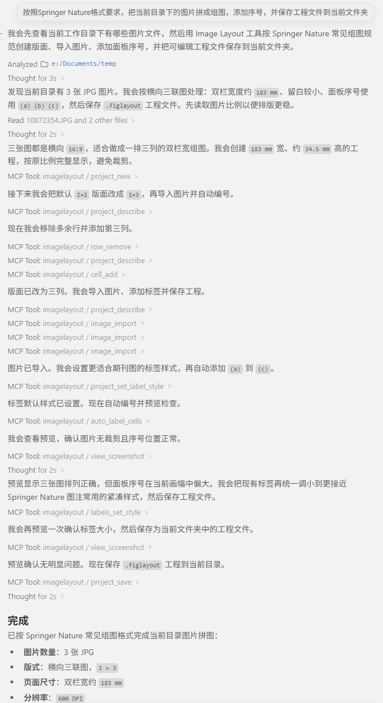

# MCP Setup Guide



Connect any MCP-compatible AI host (Claude Desktop, Claude Code, Cursor,
Windsurf, Cline, etc.) to a running ImageLayoutManager so the AI can
build and edit multi-panel figures on your behalf.

---

## How it works

```
AI host  ── stdio (MCP) ──►  imagelayout-cli mcp  ── WebSocket ──►  ILM (GUI)
```

Your AI host launches `imagelayout-cli mcp` as a subprocess. The CLI
acts as a lightweight MCP adapter — no extra Python install or packages
needed. It connects to the running ILM app over a local WebSocket.

---

## Step 1 — Enable MCP Server in the app

Open ImageLayoutManager, then: **Tools → Enable MCP Server**.

The server binds to `127.0.0.1` only — no network exposure.

---

## Step 2 — Register in your AI host

### One-click (from inside the app)

**Tools → MCP Setup Guide… → Auto Register…** — detects installed
hosts and writes the config automatically.

### Claude Desktop

Settings → Developer → Edit Config:

```json
{
  "mcpServers": {
    "imagelayout": {
      "command": "C:/Program Files/ImageLayoutManager/imagelayout-cli.exe",
      "args": ["mcp"]
    }
  }
}
```

### Claude Code

```
claude mcp add imagelayout -- "C:/.../imagelayout-cli.exe" "mcp"
```

Or use the **Copy mcp add command** button in the setup guide dialog.

### Cursor

Edit `~/.cursor/mcp.json`:

```json
{
  "mcpServers": {
    "imagelayout": {
      "command": "C:/Program Files/ImageLayoutManager/imagelayout-cli.exe",
      "args": ["mcp"]
    }
  }
}
```

### Windsurf

Edit `~/.codeium/windsurf/mcp_config.json` — same JSON format as above.

### Other MCP hosts

Any host that supports stdio MCP servers:

- **command**: path to `imagelayout-cli.exe`
- **args**: `["mcp"]`
- **transport**: stdio

---

## Step 3 — Use it

1. Make sure the app is running with MCP Server enabled.
2. Open your AI host and ask the AI to work with your figure:
   - *"Create a 2×3 figure from the images in D:\data\panels"*
   - *"Make the top row taller"*
   - *"Make all panel labels 10 pt bold with a little padding"*
   - *"Add 10 µm scale bars to the microscopy panels"*
   - *"Add a zoom inset to panel b and give it a white border"*
   - *"Save the project as figure.figlayout"*
   - *"Export to figure.png"*

Every change appears live in the ILM window. Undo any step with Ctrl+Z.

---

## What the AI can control

The MCP surface exposes 36 tools. At a high level, AI hosts can:

- Create, open, save, inspect, and export projects.
- Reshape layouts with rows, columns, nested splits, grid ratios, and freeform geometry.
- Import images and adjust fit mode, crop, rotation, padding, alignment, z-order, and SVG text normalisation.
- Generate labels, restyle all labels, restyle one text item, and add/remove free text.
- Add and configure microscopy scale bars.
- Add, remove, and style Picture-in-Picture (PiP) insets.
- Manage size groups so multiple cells share width/height.
- Set or clear persistent export regions.
- Request screenshots for visual verification.

For the LLM-facing conceptual guide, read the bundled MCP resource
`ilm://concepts` or the source file `docs/agent_concepts.md`.

---

## For source / development installs

```
claude mcp add imagelayout -- python "cli_main.py" "mcp"
```

Requires `websockets` installed in the Python environment.

---

## Troubleshooting

| Problem | Fix |
|---------|-----|
| Connection refused | MCP Server is not running. Enable it in Tools menu. |
| Authentication failed | Token regenerates on each app restart. Start a new AI session. |
| "no tool named …" | Restart both ILM and the AI host after updating, so the GUI server and `imagelayout-cli mcp` subprocess load the same tool list. |
